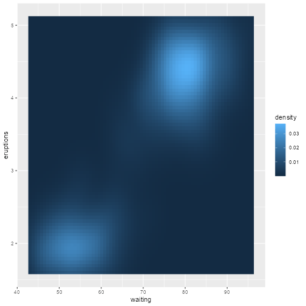

# Example of a precomputed vignette

This is an example of a precomputed vignette:

``` r
library("ggplot2")

ggplot(faithfuld, aes(waiting, eruptions)) +
  geom_raster(aes(fill = density))
```



A plot with a long caption here

See here some text:

Lorem ipsum dolor sit amet, consectetur adipiscing elit. Fusce pharetra,
ipsum vel maximus viverra, elit magna volutpat metus, eget bibendum
velit libero vel est. Integer magna lectus, sagittis cursus ligula a,
laoreet feugiat turpis. Proin molestie lacus vitae sem consectetur
placerat. Duis sed malesuada purus, at aliquet mi. Suspendisse a mollis
justo. Proin pellentesque odio pharetra velit ultricies egestas.
Curabitur sit amet tortor eu nulla lacinia scelerisque. Nulla aliquam
porttitor neque, sed auctor dui elementum luctus. Aenean nec iaculis
nibh, id laoreet velit.

Phasellus consectetur ullamcorper ligula a lobortis. In tortor massa,
bibendum quis pharetra in, egestas at orci. Donec ut sem egestas,
pulvinar odio vitae, ornare ipsum. Praesent eget ex at mauris cursus
condimentum ac posuere velit. Praesent ut enim tortor. Curabitur
placerat imperdiet nisi ornare aliquet. Quisque luctus consequat lectus.
Aliquam vehicula posuere felis, et vehicula velit malesuada ut. Nullam
orci tellus, fringilla sed venenatis id, mollis eget neque. Nunc lectus
dolor, faucibus eu congue ac, ultrices eu ligula. Proin elementum nisi
ac arcu placerat imperdiet. Praesent porta lectus a feugiat scelerisque.

Duis vel placerat odio, sit amet pulvinar arcu. Curabitur ante odio,
interdum eget consequat sit amet, dignissim sed lorem. Integer lacinia,
nulla quis egestas varius, erat lectus sagittis augue, non scelerisque
nunc enim quis dui. Aliquam erat mauris, commodo quis luctus quis,
lobortis at libero. Mauris molestie, nulla in iaculis lobortis, urna
elit faucibus nulla, eget fringilla velit felis sed urna. Donec ut eros
auctor, sollicitudin augue vel, venenatis orci. Duis blandit sem non ex
egestas consectetur. Etiam placerat, arcu quis luctus euismod, ante
augue consequat ex, sit amet hendrerit ex sapien a magna. Quisque nisi
erat, dapibus in maximus id, faucibus eget ligula. Fusce odio felis,
sodales a elit ut, condimentum ultrices eros. Fusce rutrum gravida
convallis. Mauris a lectus vel mauris commodo tempor. Etiam eros nibh,
auctor vitae turpis ac, gravida ultricies sem. Donec sit amet
pellentesque enim, eu maximus elit. Interdum et malesuada fames ac ante
ipsum primis in faucibus.

Duis gravida sodales justo id ultrices. Class aptent taciti sociosqu ad
litora torquent per conubia nostra, per inceptos himenaeos. Sed non dui
vitae quam sollicitudin rutrum quis at lacus. Nunc egestas commodo
mollis. In aliquam pellentesque mi eget tincidunt. Nulla scelerisque
commodo volutpat. In vel erat cursus urna facilisis consequat vel in
urna. Donec viverra consequat elementum. Duis pretium tortor sed maximus
gravida. Cras efficitur suscipit tellus, ut lacinia arcu pellentesque
quis.

Aenean nec accumsan leo, in ultrices elit. Aliquam vestibulum elit ut
lorem rutrum malesuada. Fusce vulputate arcu non elit gravida ultrices.
Ut nisi odio, feugiat et blandit a, dapibus non nisi. Vestibulum
tristique viverra scelerisque. Vestibulum laoreet at quam ut
ullamcorper. Vivamus in nisi sed justo eleifend commodo nec sit amet
magna. Sed nulla dui, laoreet nec felis vitae, maximus mollis turpis. Ut
vitae quam ac felis convallis suscipit at et risus. Sed sollicitudin,
lacus non ullamcorper ultricies, ligula lorem rhoncus sem, ut feugiat
erat magna nec urna. Sed faucibus, tortor sit amet tempor volutpat,
mauris enim posuere neque, ut maximus leo massa sed nisi. Donec
efficitur mi dolor, non cursus dui tempor vel.

**Generated 5 paragraphs, 513 words, 3428 bytes of [Lorem
Ipsum](https://www.lipsum.com/)**
